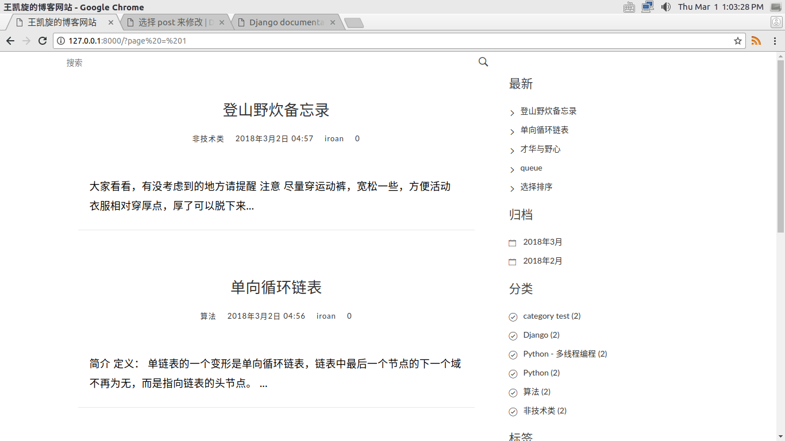
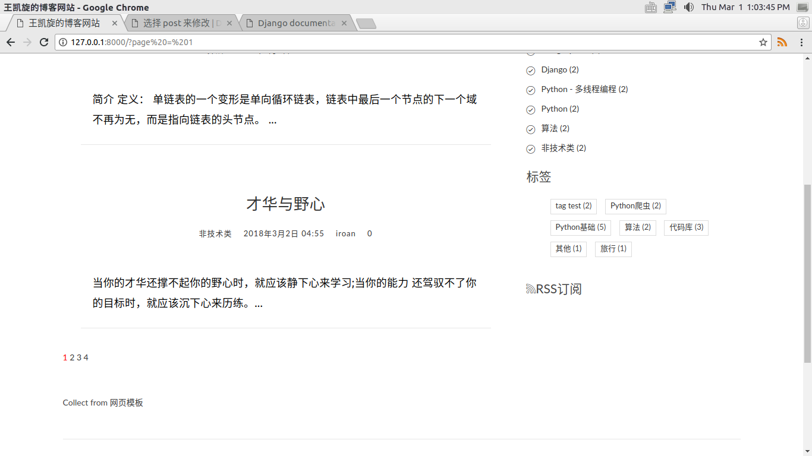
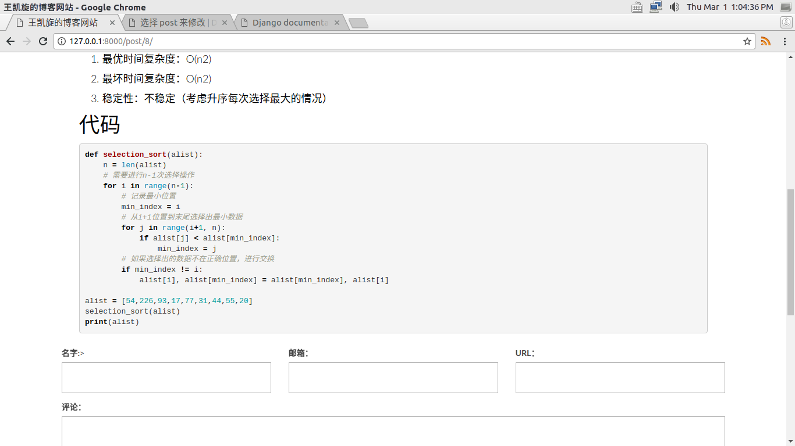
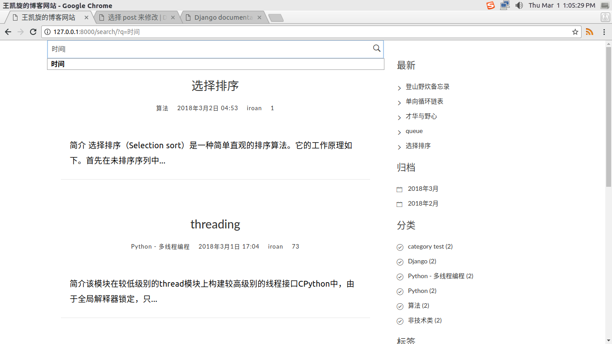

使用Django开发个人博客网站
# 开发环境
- Ubuntu16.04
- virtualenv
- Pycharm
- 用到的相关库可查看`requirements.txt`

# 实现的功能
1. 支持以markdown语法编写的文章
1. 侧边栏显示最新发布的文章,归档文章,分类,标签
1. 文章标题和文章内容的搜索
1. 可以对某一篇文章进行评论
1. 粗略统计某一篇文章的阅读量,并显示
1. 文章的分页

# 涉及的技术
1. MVT(MVC)
1. 静态文件管理
1. 分页
1. ORM
1. django的数据库查询
1. 正则表达式
1. 模型的表单
1. 通用视图

# 截图

# 其他
开发的这个网站可以部署到云服务器,通过互联网让其他人都能看到,前提是要有云服务器.阿里云的学生优惠我是没有了,最低配云服务器相对我来说还是一笔不小的开支.所以就没有部署到服务器.我在万网上买了一个域名,还以为立马能够使用呢,没想到还要进行备案,虽然阿里云的工作人员不过元宵节坚守岗位,完成了初审,但是要求我用专业相机和幕布拍照来完成备案,真的是很麻烦!!一是我没有专业相机,二是我也没有幕布啊,难道要买吗?

...算了,现在事多,以后再部署吧!